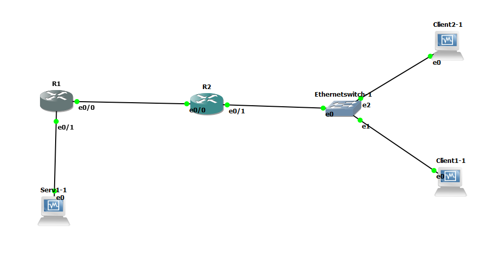

# B1A-tp-5-reseau


## 1. Préparation VMs

C'est beau


**Réseaux :**

* `net1` : `10.5.1.0/24`
* `net2` : `10.5.2.0/24`
* `net12` : `10.5.12.0/24`

**Machines :**

Machine | `net1` | `net2` | `net12`
--- | --- | --- | ---
`client1.tp5.b1` | X | `10.5.2.10` | X
`client2.tp5.b1` | X | `10.5.2.11` | X
`router1.tp5.b1` | `10.5.1.254` | X | `10.5.12.1`
`router2.tp5.b1` | X | `10.5.2.254` | `10.5.12.2`
`server1.tp5.b1` | `10.5.1.10` | X | X

# II. Lancement et configuration du lab

### Checklist IP VMs 

On parle de `client1.tp5.b1`, `client2.tp5.b1` et `server1.tp5.b1` :
* [X] Désactiver SELinux
  * déja fait dans le patron
* [X] Installation de certains paquets réseau
  * déja fait dans le patron
* [X] Désactivation de la carte NAT
  * déja fait dans le patron
* [X] Définition des IPs statiques
* [X] Définition du nom de domaine

### Checklist IP Routeurs 

On parle de `router1.tp5.b1` et `router2.tp5.b1` :
* [X] Définition des IPs statiques & définition du nom de domaine
  * Router 1:
  ```
  router1#show ip int br
  Interface                  IP-Address      OK? Method Status                Protocol
  Ethernet0/0                10.5.12.1       YES NVRAM  up                    up
  Ethernet0/1                10.5.1.254      YES NVRAM  up                    up
  Ethernet0/2                unassigned      YES NVRAM  administratively down down
  Ethernet0/3                unassigned      YES NVRAM  administratively down down
  ```
  * Router 2:
  ```
  router2#show ip int br
  Interface                  IP-Address      OK? Method Status                Protocol
  Ethernet0/0                10.5.12.2       YES NVRAM  up                    up
  Ethernet0/1                10.5.2.254      YES NVRAM  up                    up
  Ethernet0/2                unassigned      YES NVRAM  administratively down down
  Ethernet0/3                unassigned      YES NVRAM  administratively down down
  ```

### Checklist routes 

On parle de toutes les machines :
* [X] `router1.tp5.b1`  
  * directement connecté à `net1` et `net12`  
  * route à ajouter : 
  ```
  10.0.0.0/24 is subnetted, 3 subnets
  C      10.5.12.0 is directly connected, Ethernet0/0
  S      10.5.2.0 [1/0] via 10.5.12.254
                  [1/0] via 10.5.12.0
                  [1/0] via 10.5.12.2
  C      10.5.1.0 is directly connected, Ethernet0/1
  ```
* [X] `router2.tp5.b1`
  * directement connecté à `net2` et `net12`
  * route à ajouter : 
  ```
       10.0.0.0/24 is subnetted, 3 subnets
  C     10.5.12.0 is directly connected, Ethernet0/0
  C     10.5.2.0 is directly connected, Ethernet0/1
  S     10.5.1.0 [1/0] via 10.5.12.254
                 [1/0] via 10.5.12.0
                 [1/0] via 10.5.12.1
  ```
* [X] `server1.tp5.b1`
  * Vers client 1 
    ```
    [root@server1 etc]# ping client1
    PING client1 (10.5.2.10) 56(84) bytes of data.
    64 bytes from client1 (10.5.2.10): icmp_seq=1 ttl=62 time=64.2 ms
    64 bytes from client1 (10.5.2.10): icmp_seq=2 ttl=62 time=26.5 ms
    ```
  * Vers client 2
    ```
    [root@server1 etc]# ping client2
    PING client2 (10.5.2.11) 56(84) bytes of data.
    64 bytes from client2 (10.5.2.11): icmp_seq=1 ttl=62 time=43.3 ms
    64 bytes from client2 (10.5.2.11): icmp_seq=2 ttl=62 time=33.1 ms
    ```


* [X] `client1.tp5.b1`
  * Vers server 1
    ```
    [root@client1 etc]# ping server1
    PING server1 (10.5.1.10) 56(84) bytes of data.
    64 bytes from server1 (10.5.1.10): icmp_seq=1 ttl=62 time=36.7 ms
    64 bytes from server1 (10.5.1.10): icmp_seq=2 ttl=62 time=38.0 ms
    ```
* [X] `client2.tp5.b1`
  * Vers server 1
    ```
    [root@client2 etc]# ping server1
    PING server1 (10.5.1.10) 56(84) bytes of data.
    64 bytes from server1 (10.5.1.10): icmp_seq=1 ttl=62 time=34.7 ms
    64 bytes from server1 (10.5.1.10): icmp_seq=2 ttl=62 time=43.7 ms
    ```

    
# III. DHCP
Attribuer des IPs statiques et des routes sur les VMs c'est chiant non ? **Serveur [DHCP](../../cours/lexique.md#dhcp--dynamic-host-configuration-protocol)** à la rescousse.  

Une section dédiée popera dans le cours d'ici peu.  

Un serveur [DHCP](../../cours/lexique.md#dhcp--dynamic-host-configuration-protocol) :
* permet d'attribuer dynamiquement des IPs
  * on a pas besoin de les définir à la main
* est principalement utilisé pour des [clients](../..//cours/3.md#clientserveur)
  * on préfère avoir des IPs fixes (statiques) pour les [serveurs](../../cours/3.md#clientserveur) et les équipements réseaux (comme les [routeurs](../../cours/lexique.md#routeur))
  * ce serait un peu le dawa s'ils changeaient tout le temps
* permet aussi de distribuer d'autres infos aux [clients](../..//cours/3.md#clientserveur)
  * comme des routes !

## 1. Mise en place du serveur DHCP

On va recycler `client2.tp5.b1` pour ça (pour économiser un peu de ressources).  

**1. [Renommer la machine](../../cours/procedures.md#changer-son-nom-de-domaine**)
  * pour porter le nom `dhcp-net2.tp5.b1`

**2. Installer le serveur DHCP** en faisant un peu de crasse : 
  * éteindre la VM dans GNS3
  * ouvrir VirtualBox
  * ajouter une carte NAT à la VM
  * démarrer la VM dans VirtualBox
  * allumer la carte NAT
  * `sudo yum install -y dhcp` 
  * shutdown la VM

**3. Rallumer la VM dans GNS**

**4. Configuration du serveur DHCP**
* le fichier de configuration se trouve dans `/etc/dhcp/dhcpd.conf`
  * [un modèle est trouvable ici](./dhcp/dhcpd.conf)

**5. Faire un test**
* avec une nouvelle VM ou `client1.tp5.b1`
  * [configurer l'interface en DHCP, en dynamique (pas en statique)](../../cours/procedures.md#définir-une-ip-dynamique-dhcp)
  * utiliser [`dhclient`](../../cours/lexique.md#dhclient-linux-only)
* dans un cas comme dans l'autre, vous devriez récupérer une IP dans la plage d'IP définie dans `dhcpd.conf`

## 2. Explorer un peu DHCP
Le principe du protocole DHCP est le suivant : 
* on a un serveur sur un réseau, il attend que des clients lui demande des IPs
* des clients peuvent arriver sur le réseau (câble, WiFi, ou autres) et demander une IP
* le serveur attribuera une IP dans une plage prédéfinie
* le serveur va créer un **"bail DHCP"** par client, pour s'en souvenir
  * **dans le bail il y a écrit "j'ai donné telle IP à telle MAC"**
  * comme ça, si le même client revient, il garde son IP

---

La discussion entre le client et le serveur DHCP se fait en 4 messages simples, **"DORA"** :
* **"Discover"** : du client vers le serveur
  * le client cherche un serveur DHCP en envoyant des Discover en broadcast
* **"Offer"** : du serveur vers le client
  * Si un serveur reçoit un "Discover" il peut répondre un "Offer" au client
  * Il propose une IP au client
* **"Request"** : du client vers le serveur
  * Permet de demander une IP au serveur
  * C'est celle que le serveur lui a proposé
* **"Acknowledge"** : du serveur vers le client
  * Le serveur attribue l'adresse IP au client
  * Il crée un bail DHCP en local
  * Il peut aussi fournir au client d'autres infos comme l'adresse de gateway

---

**OKAY**, le but : 
* faire une demande DHCP
  * avec [`dhclient`](../../cours/lexique.md#dhclient-linux-only)
  * capturer avec Wireshark l'échange du DORA
    * vous pouvez `tcpdump` sur le `client1.tp5.b1` ou sur `dhcp-net2.tp5.b1`
    * ou vous pouvez clic-droit sur un lien dans GNS3 et lancer une capture

---

### IV. Bonus